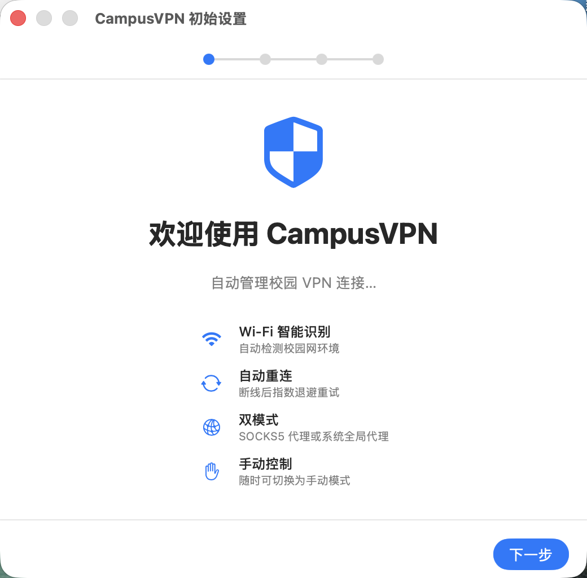
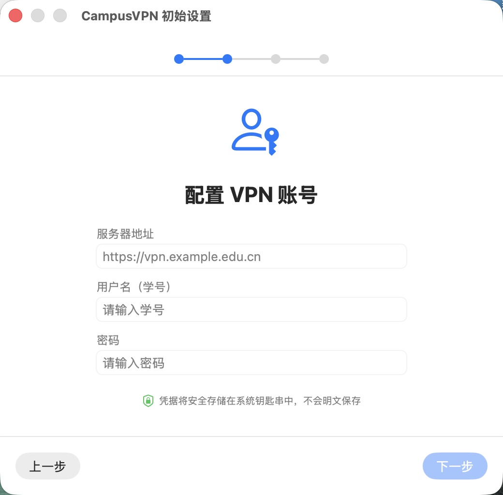
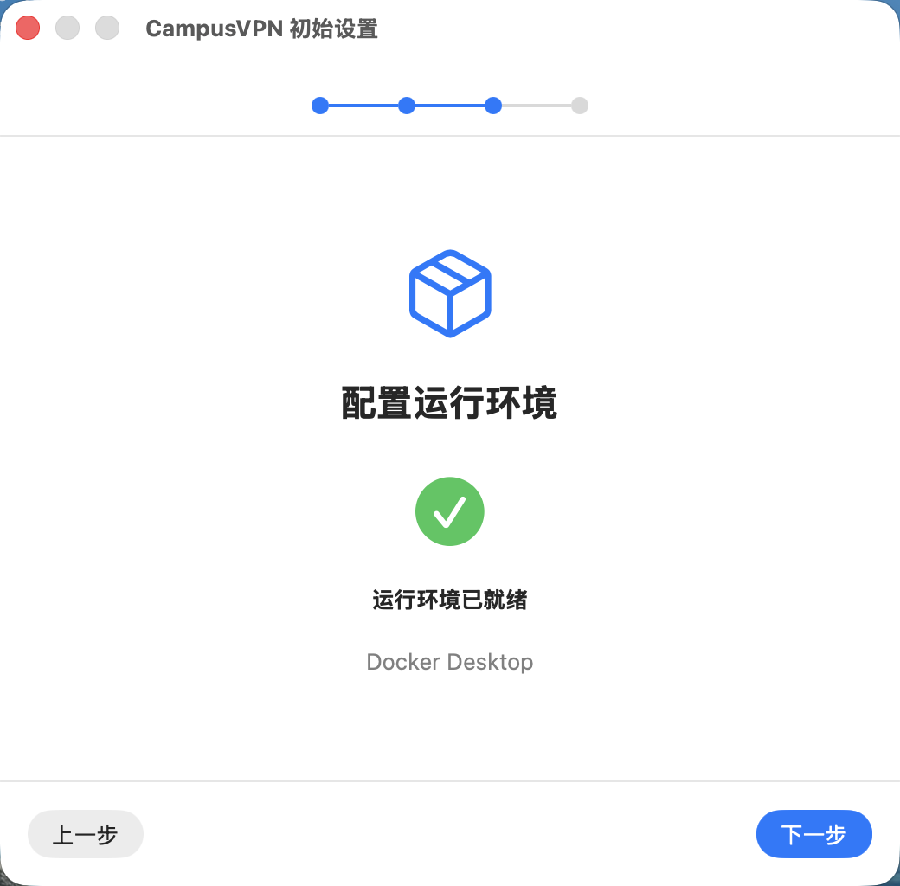
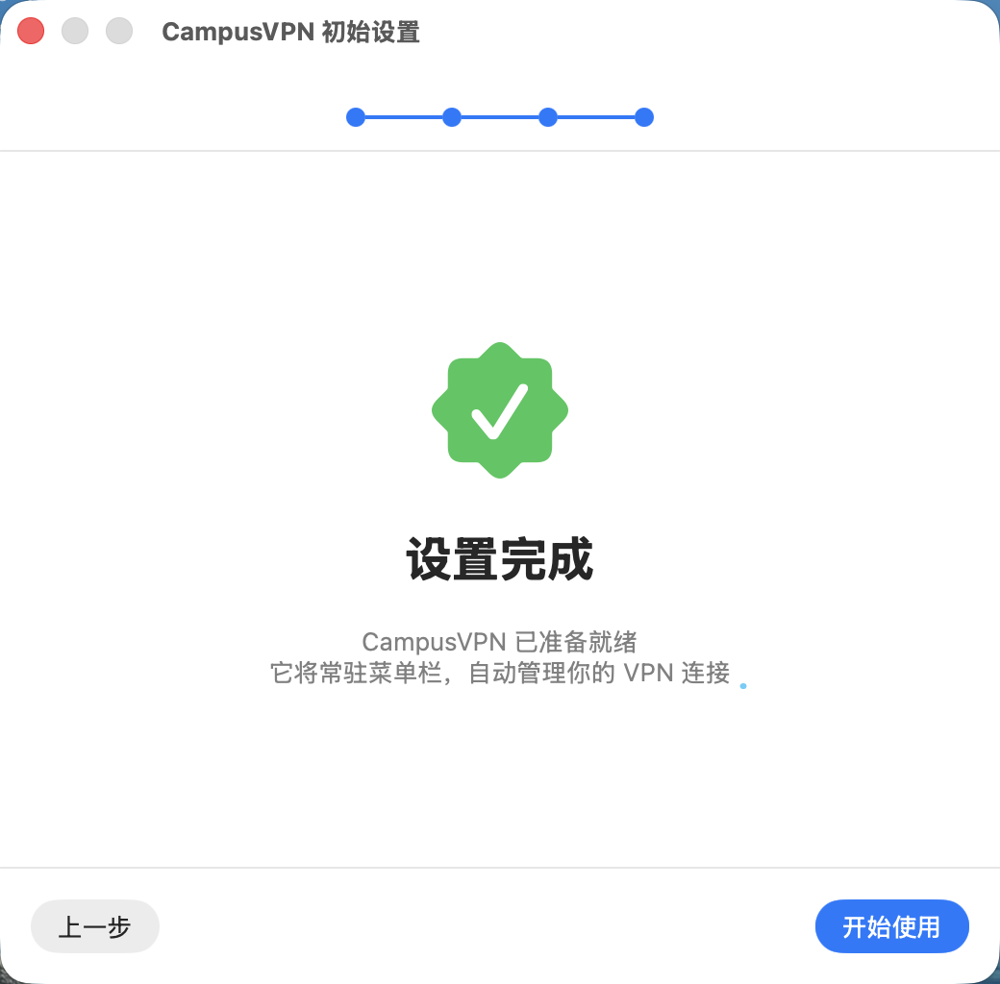
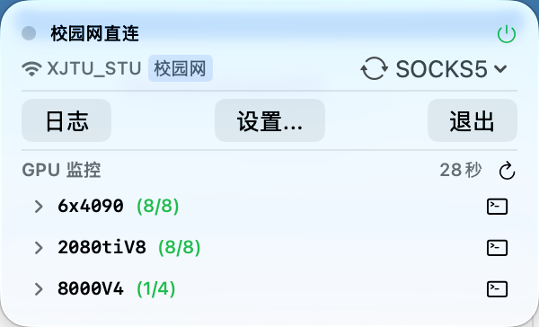
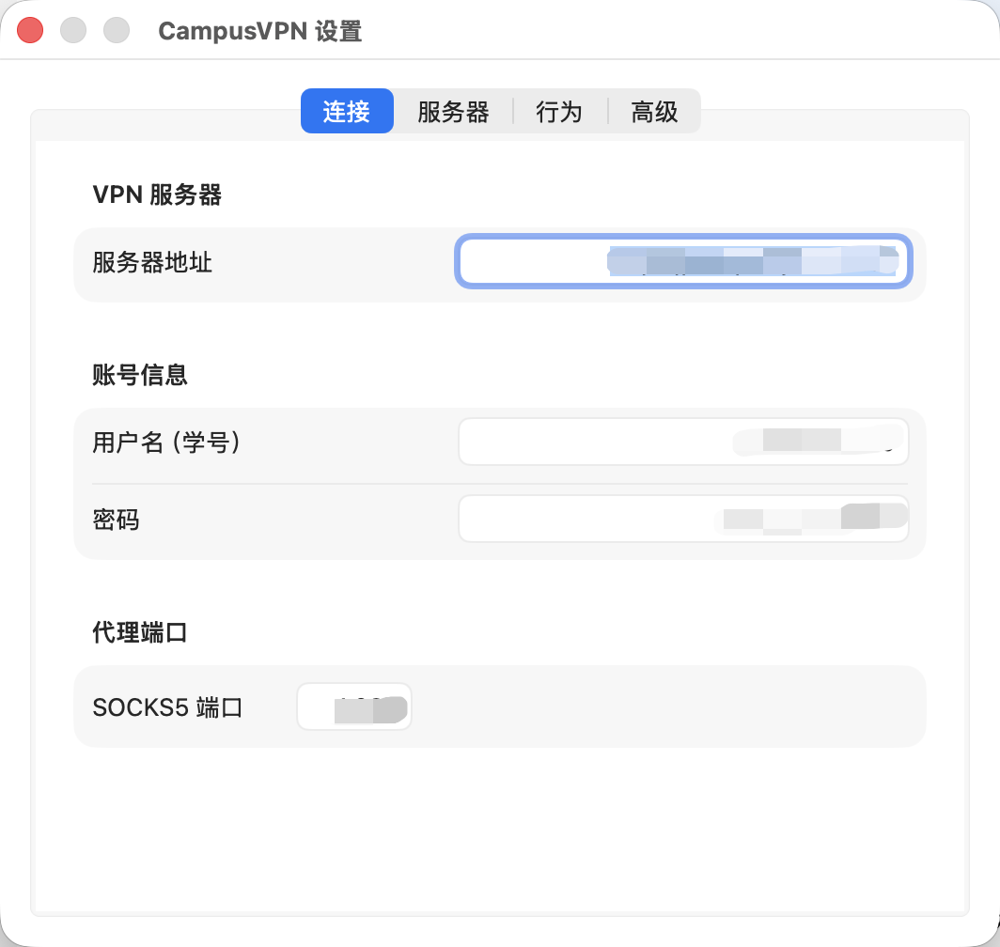
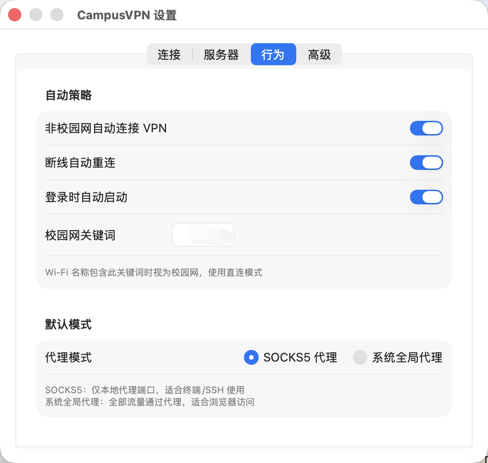
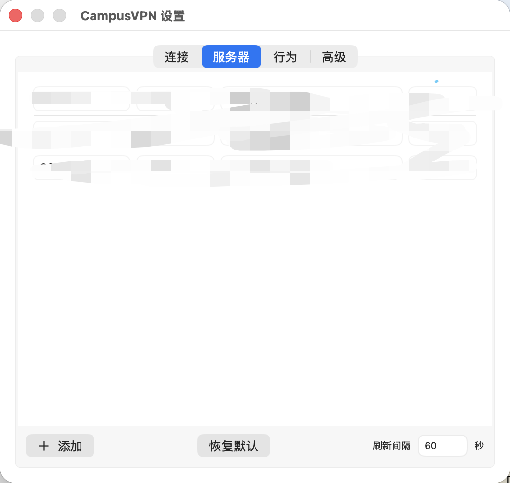

# CampusVPN

面向校园网的 **macOS 菜单栏应用**：在检测到校园 Wi‑Fi 时自动拉起 EasyConnect 容器、建立 VPN，并提供 SOCKS5 / 系统代理切换、日志与可选的远程 GPU 占用监控。

**CampusVPN** is a native **macOS 14+** menu bar app that orchestrates Docker-based EasyConnect, applies network policy (SSID keyword matching), and exposes proxy controls plus optional SSH GPU monitoring.

---

## 首次使用

1. 启动后完成 **引导页**：填写 VPN 服务器地址、用户名、密码（密码进 Keychain）、校园 SSID 关键词等。
2. 在 **系统设置 → 隐私与安全性 → 定位服务** 中为 CampusVPN 开启定位（**使用期间**即可），以便读取当前 Wi‑Fi 名称。
3. 确保 Docker/Colima 已运行，镜像可正常拉取。

### 首次引导流程

<table>
<tr>
<td align="center" valign="top" width="33%">
<strong>① 引导 · 欢迎</strong><br/><sub>功能概览</sub><br/>

</td>
<td align="center" valign="top" width="33%">
<strong>② 引导 · 配置 VPN 账号</strong><br/><sub>服务器、学号、密码（进钥匙串）</sub><br/>

</td>
<td align="center" valign="top" width="33%">
<strong>③ 引导 · 运行环境</strong><br/><sub>Docker / Colima 检测</sub><br/>

</td>
</tr>
<tr>
<td align="center" colspan="3" valign="top">
<strong>④ 引导 · 设置完成</strong><br/><sub>应用常驻菜单栏</sub><br/>

</td>
</tr>
</table>

---

## 界面预览

### 菜单栏主面板

<p align="center">
<strong>菜单栏主面板</strong><br/><sub>校园网/代理状态、日志与设置、底部 GPU 监控</sub><br/>

</p>

点击菜单栏图标展开；可查看当前 Wi‑Fi 与策略标签、切换 SOCKS5 / 系统代理、打开日志与设置。GPU 列表在面板最下方，降低误触。

### 设置窗口

<table>
<tr>
<td align="center" valign="top" width="33%">
<strong>设置 · 连接</strong><br/><sub>VPN 服务器、账号、SOCKS5 端口</sub><br/>

</td>
<td align="center" valign="top" width="33%">
<strong>设置 · 行为</strong><br/><sub>自动连接/重连、校园网关键词、代理模式</sub><br/>

</td>
<td align="center" valign="top" width="33%">
<strong>设置 · 服务器</strong><br/><sub>GPU SSH 主机与刷新间隔</sub><br/>

</td>
</tr>
</table>

---

## 功能概览

| 能力                 | 说明                                                                                              |
| -------------------- | ------------------------------------------------------------------------------------------------- |
| **校园网识别**       | 通过 CoreWLAN 读取当前 SSID（需授予「使用期间」**位置**权限，否则系统可能隐藏 Wi‑Fi 名称）。      |
| **策略与自动连接**   | 可配置 SSID 关键词（默认占位为 `campus`，请改为本校 Wi‑Fi 名称片段）、进入校园网自动连接、断线自动重连。 |
| **EasyConnect**      | 使用 `hagb/docker-easyconnect:cli` 镜像，由应用内嵌逻辑管理容器生命周期与健康检查。               |
| **代理模式**         | SOCKS5 本地端口（默认 `1080`）与系统级代理（`networksetup`）可切换。                              |
| **凭据**             | VPN 账号密码存入 **Keychain**，不写入明文配置文件。                                               |
| **GPU 监控（可选）** | 通过 SSH 并行查询多台机器上的 `nvidia-smi`，菜单栏摘要显示空闲/总卡数；详情在面板底部，减少误触。 |
| **独立窗口**         | 首次引导、日志、设置使用独立窗口，避免被菜单栏面板遮挡。                                          |

---

## 环境要求

- **macOS 14.0** 及以上（Swift Package 中 `platforms: [.macOS(.v14)]`）。
- **Docker** 或 **Colima** 等兼容 Docker CLI 的运行时，用于拉取并运行 EasyConnect 容器。
- **Xcode / Command Line Tools**：用于 `swift build`；可选使用 **XcodeGen** 生成 Xcode 工程（见 `setup.sh`）。

---

## 从源码构建

```bash
cd CampusVPN
export DEVELOPER_DIR=/Library/Developer/CommandLineTools   # 若仅用 CLT

swift build
# 或打调试/发布包并生成 .app：
./build.sh          # debug，输出 .build/debug/CampusVPN.app
./build.sh release  # release，输出 .build/release/CampusVPN.app
```

安装到应用程序文件夹：

```bash
cp -R .build/release/CampusVPN.app /Applications/
open /Applications/CampusVPN.app
```

应用为 **LSUIElement**（纯菜单栏），Dock 中无图标。

---

## 下载成品（GitHub Releases）

在本仓库 GitHub 的 **Releases** 页面下载 **`CampusVPN.app.zip`**。在「访达」或终端中解压后，**当前目录下应直接出现 `CampusVPN.app`**（应用包，非再嵌套一层文件夹），拖入「应用程序」即可。GitHub 只能上传单个附件，故用 zip 封装；发布前 CI 会校验 zip 内根路径为 `CampusVPN.app/`。（当前 CI 在 Apple Silicon 上构建。）

首次从网络打开未公证的应用时，可在「访达」中右键 → **打开**，或在「系统设置 → 隐私与安全性」中允许运行。

**维护者发布新版本**：先按需修改 `build.sh` 里的 `CFBundleShortVersionString` / `CFBundleVersion`，再打 tag 并推送，GitHub Actions 会自动构建并上传 `CampusVPN.app.zip` 与 `SHA256SUMS.txt`：

```bash
git add build.sh && git commit -m "chore: bump version for release"
git tag v1.0.1
git push origin main
git push origin v1.0.1
```

---

## GPU 监控配置

在 **设置 → 服务器** 中维护 SSH 主机列表（别名、用户、`host:port`）。应用通过 `ssh` 调用远程 `nvidia-smi`；请确保本机已配置免密或可用 **ssh-agent**，且网络可达目标主机。菜单栏与主面板底部会汇总各机「空闲/总卡数」。

仓库内默认占位数据仅为示例，**请替换为你自己的服务器信息**，勿将真实地址与账号提交到公开仓库。

---

## 仓库布局（简要）

```
CampusVPN/
├── docs/screenshots/      # README 用界面截图
├── Package.swift          # SwiftPM 可执行目标
├── build.sh               # 组装 Info.plist 与 .app
├── setup.sh               # 可选：XcodeGen 生成 Xcode 工程
├── project.yml            # XcodeGen 描述
└── CampusVPN/             # 源码与资源
    ├── CampusVPNApp.swift
    ├── AppDelegate.swift
    ├── Views/
    ├── Services/          # VPN、代理、容器、网络、GPU 等
    └── Models/
```

---

## 安全与隐私

- 密码仅保存在 **钥匙串**；`serverURL`、用户名等存 **UserDefaults**。
- 应用内日志与错误信息中 **不记录 Wi‑Fi SSID**；含 Docker/EasyConnect 的输出会对 **`-p` 密码参数** 做脱敏后再写入日志。
- 默认校园网关键词为占位 **`campus`**，请在本机设置中改为实际关键词；**勿**在公开仓库中提交真实服务器、账号或 `docs/screenshots` 中的真实环境截图。

---

## 许可

本项目以源码形式分享；若你需明确开源协议，可自行添加 `LICENSE` 文件（例如 MIT）。

---

## 致谢

- EasyConnect 容器镜像：[hagb/docker-easyconnect](https://github.com/Hagb/docker-easyconnect)
- 由 SwiftBar 脚本方案演进为独立原生应用，便于系统集成与维护。
